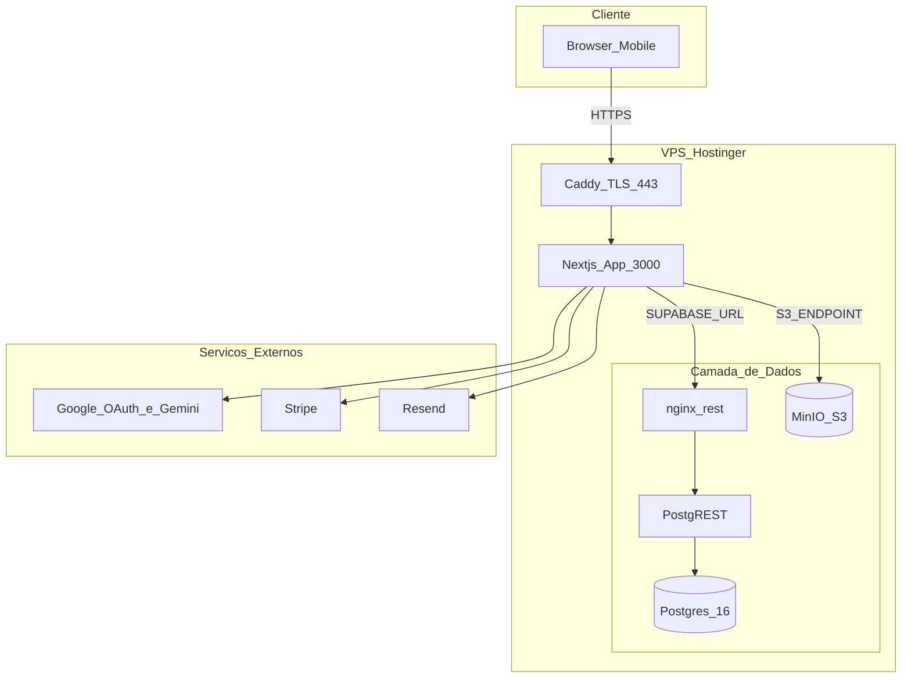
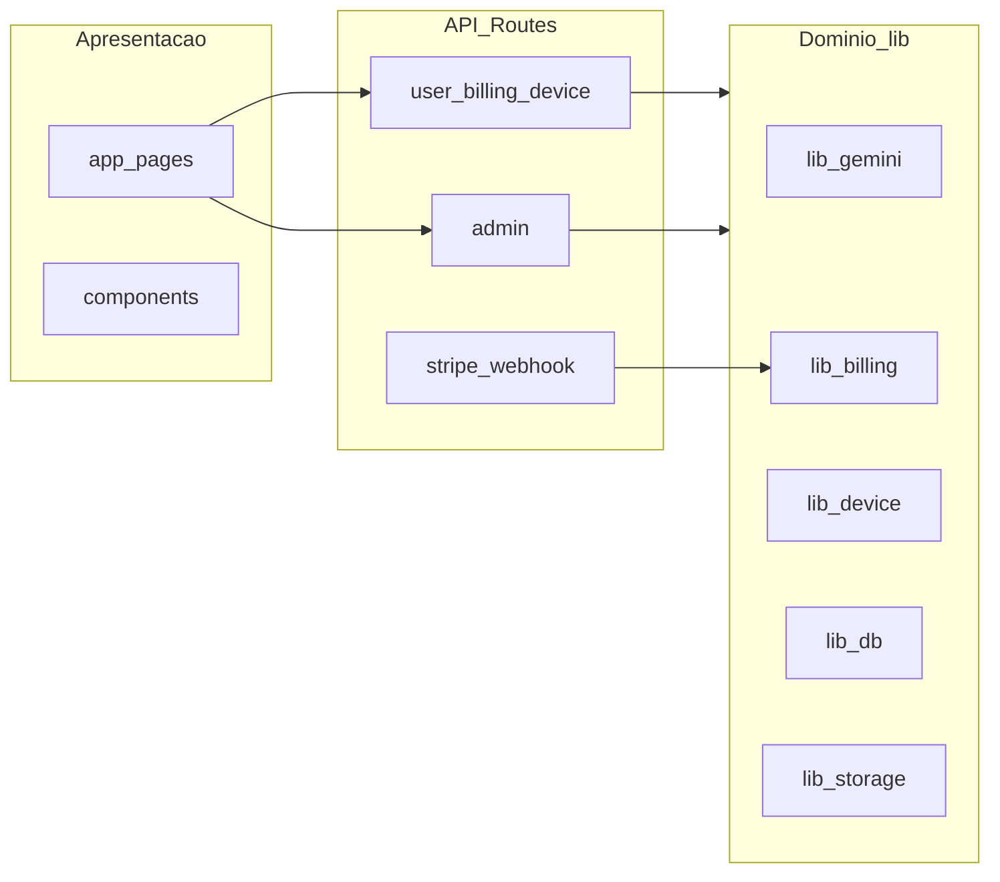

# Diagrama do sistema

## Visão de produção (VPS)

## Camadas lógicas

## Onde cada dado vive

| Dado | Armazenamento | Acesso |
|------|---------------|--------|
| Perfis, planos, gerações (metadata) | Postgres | `lib/db/*` via Supabase client |
| Fotos e artes (binários) | MinIO bucket `generations` | `lib/object-storage.ts` |
| Sessão usuário | Cookie JWT (Auth.js) | `auth.ts` |
| Sessão admin | Cookie assinado HMAC | `lib/admin-auth.ts` |
| Config Stripe/Resend | `platform_settings` ou env | `lib/db/settings.ts` |

## Rede Docker

Todos os serviços compartilham a rede bridge `instaads`. Apenas **Caddy** expõe portas 80/443 para a internet. O app Next.js **não** é exposto diretamente.

Ver [[Docker-Compose]] e [[Caddy-TLS]].
