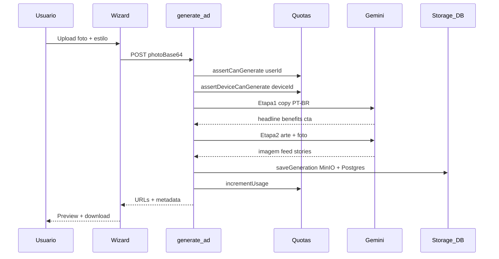
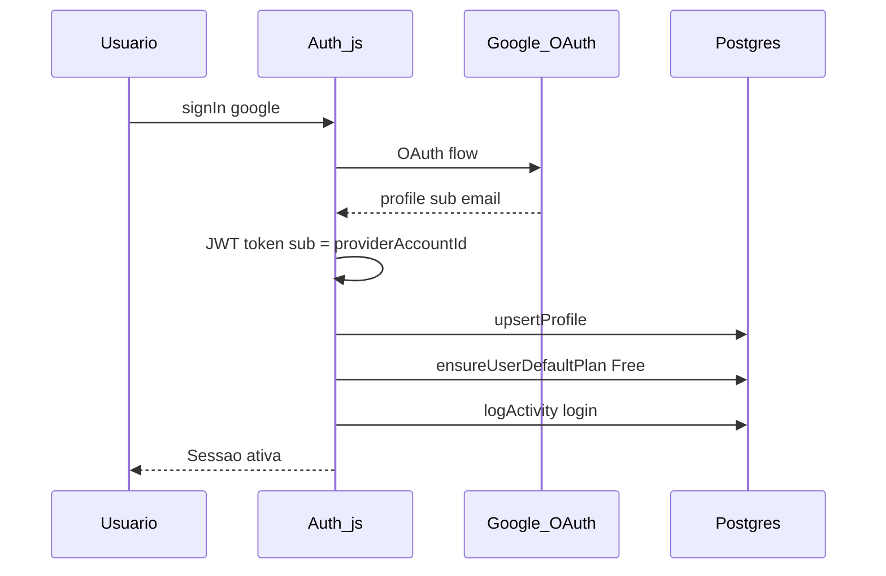

# Fluxos principais

## 1. Gerar anúncio

**Arquivos-chave:** `app/api/generate-ad/route.ts`, `lib/gemini.ts`, `lib/storage.ts`, `lib/billing/usage.ts`, `lib/device/limits.ts`

**Timeout:** `maxDuration = 120` segundos (geração de imagem pode levar 30–60s).

---

## 2. Login Google

**ID estável:** `user.id` = Google `sub` / `providerAccountId` (necessário para OAuth consistente na VPS). Ver [[Autenticacao]].

---

## 3. Upgrade de plano (Stripe)

1. Usuário acessa `/planos`
2. `GET /api/billing/usage` — plano atual + lista de planos
3. `POST /api/billing/checkout` — cria sessão Stripe Checkout
4. Redirect Stripe → pagamento
5. Webhook `POST /api/stripe/webhook` — atualiza `subscriptions` e `profiles.plan_id`
6. Redirect de volta com `?success=1`

Chaves Stripe: env ou `/admin/settings`. Ver [[Billing-Planos]].

---

## 4. Acesso admin

1. Navegar para `/admin` (URL direta, sem link no app)
2. Tela de login — senha `ADMIN_PASSWORD`
3. `POST /api/admin/login` — cookie `instaads_admin` assinado (7 dias)
4. APIs `/api/admin/*` validam cookie via `requireAdminSession()`

---

## 5. Limite por dispositivo (Free)

1. Cliente gera UUID em `localStorage` + cookie `instaads_did`
2. `POST /api/device/sync` — associa device ↔ user
3. Em `generate-ad`: se plano Free e não whitelist:
   - Bloqueia segunda conta no mesmo device
   - Pool de 5 gerações/mês **por device**
4. Usuário bloqueado pode solicitar acesso → admin aprova → whitelist

Ver [[Billing-Planos#Device limits]] e `/admin/device-access`.

---

## 6. Deploy (CI/CD)

Push `main` → GitHub Actions (runner na VPS) → `deploy/deploy.sh` → rebuild container `app`.

Ver [[CI-CD]].
