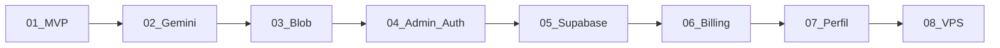

# Timeline de commits

Repositório: [leonardomendes201704/InstaAds](https://github.com/leonardomendes201704/InstaAds)

| # | Data | Commit | Fase | Resumo |
|---|------|--------|------|--------|
| 1 | 2026-09-02 | [[001-bdc97fa]] | [[01-mvp-wizard]] | Initial commit: InstaAds mobile-first wizard for Instagram ads with OpenAI. |
| 2 | 2026-09-02 | [[002-318345a]] | [[02-gemini-ia]] | Migrar integração de IA de OpenAI para Google Gemini |
| 3 | 2026-09-02 | [[003-edbbc4f]] | [[02-gemini-ia]] | Uso de modelo gemini-3.6-flash |
| 4 | 2026-09-02 | [[004-167007d]] | [[02-gemini-ia]] | Melhoria na geracao do anuncio |
| 5 | 2026-09-02 | [[005-9ba0bdc]] | [[02-gemini-ia]] | Gerar copy em PT-BR antes da arte e fixar textos exatos na imagem. |
| 6 | 2026-09-03 | [[006-8eb4641]] | [[02-gemini-ia]] | Simplificar Passo 2: mensagem opcional, Feed padrão e UI mais enxuta. |
| 7 | 2026-09-03 | [[007-0d4b06e]] | [[03-armazenamento]] | Persistir fotos e artes geradas no Vercel Blob com sessão anônima. |
| 8 | 2026-09-03 | [[008-510bd92]] | [[03-armazenamento]] | Corrigir upload no Vercel Blob private store (access private). |
| 9 | 2026-09-03 | [[009-7a541ba]] | [[03-armazenamento]] | Salvar estimativa de custo de IA e corrigir detecção do Vercel Blob. |
| 10 | 2026-09-03 | [[010-7e3b04e]] | [[04-admin-auth]] | Adicionar painel admin em /admin com login e listagem de gerações. |
| 11 | 2026-09-03 | [[011-7b1b986]] | [[04-admin-auth]] | Adicionar login obrigatorio com Google via Auth.js. |
| 12 | 2026-09-03 | [[012-e51cfd9]] | [[02-gemini-ia]] | Evitar rótulos HEADLINE/SUBHEADLINE na arte gerada. |
| 13 | 2026-09-03 | [[013-a193416]] | [[04-admin-auth]] | Integrar logo InstaAds e adicionar paginas legais. |
| 14 | 2026-09-03 | [[014-ccc682b]] | [[04-admin-auth]] | Adicionar verificacao Google Search Console no site. |
| 15 | 2026-09-03 | [[015-6c9d6e7]] | [[05-supabase]] | Migrar para Supabase, expandir admin e fundos no login. |
| 16 | 2026-09-03 | [[016-833c0d2]] | [[05-supabase]] | Adicionar migracao Blob para Supabase via painel admin. |
| 17 | 2026-09-03 | [[017-2e39470]] | [[05-supabase]] | Corrigir scroll do admin e backfill de atividades. |
| 18 | 2026-09-03 | [[018-4a4d3e4]] | [[06-billing]] | Implementar Fase 2: planos, quotas e billing com Stripe/Resend no admin. |
| 19 | 2026-09-03 | [[019-a153452]] | [[06-billing]] | Adicionar limite por dispositivo no Free, whitelist e solicitações de acesso. |
| 20 | 2026-09-03 | [[020-44998d5]] | [[06-billing]] | Adicionar lightbox de comparacao original vs arte no admin de geracoes. |
| 21 | 2026-09-03 | [[021-ff12c84]] | [[06-billing]] | Substituir grafico SVG do dashboard por Chart.js com usuarios vs geracoes. |
| 22 | 2026-09-04 | [[022-a72fba7]] | [[07-perfil-usuario]] | Adicionar pagina de perfil do usuario com plano, uso e geracoes recentes. |
| 23 | 2026-09-04 | [[023-e048151]] | [[07-perfil-usuario]] | Corrigir scroll mobile e adicionar lightbox com download no perfil. |
| 24 | 2026-09-04 | [[024-a44f063]] | [[08-vps-deploy]] | Migrar app para deploy self-hosted na VPS com Docker. |
| 25 | 2026-09-04 | [[025-abbe263]] | [[08-vps-deploy]] | Adicionar deploy automático via GitHub Actions self-hosted runner. |

## Evolução por fase

> Regenerar: `npm run vault:changelog`

